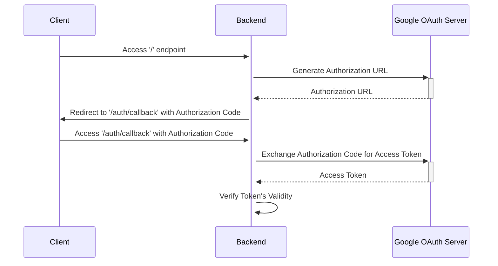
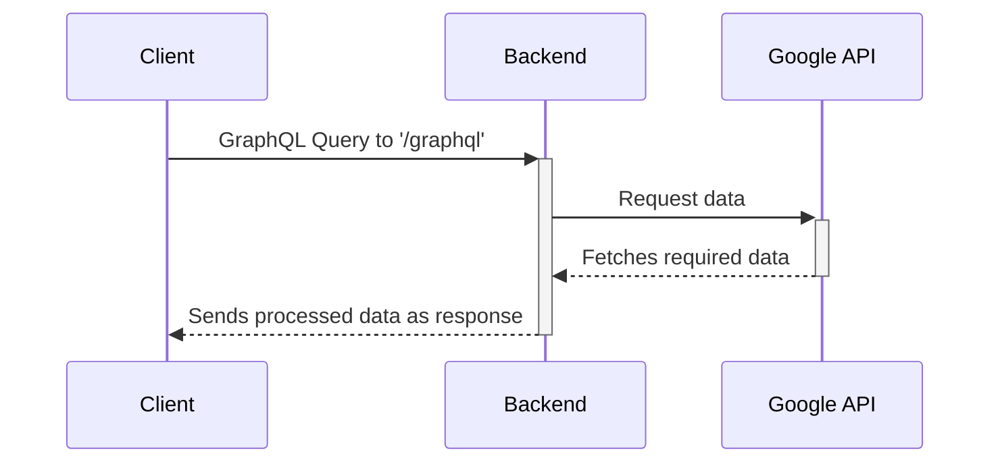

# Fastify-GraphQL-GoogleAPIs
This project is a GraphQL server designed to interface with Google APIs, specifically Google Calendar and Google People APIs. It authenticates using Google tokens to fetch user data, providing a seamless integration for applications requiring access to Google services.

## Getting Started

### Prerequisites

- Node.js installed on your machine.
- A Google Cloud account and a project with OAuth 2.0 set up.

### Configuring an OAuth application in GCP
1. Create a Google Clound account here: https://cloud.google.com.
2. Create the OAuth application.
3. Enabled respective APIs and Services.
4. Create OAuth consent screen App.
5. Create Credentials and Oauth 2.0 Client.
6. Generate Access tokens.

### Installation

1. Clone the repository to your local machine:

```sh
git clone https://github.com/aviperetz91/fastify-graphql-googleapis-demo.git
```

2. Navigate to the project directory:

```sh
cd Fastify-GraphQL-GoogleAPIs
```

3. Install dependencies:

```sh
npm install
```

4. Create a .env file in the root directory and add the required environment variables as described in the .env.example file.

5. Configure your Google OAuth credentials in configuration/credentials.ts.

### Running the Server

- To start the server in development mode with hot reload

```sh
npm run dev
```

- To start the server in production mode:
```sh
npm start
```

## Features

- **Google OAuth 2.0 Authentication**: Securely authenticate using Google tokens.
- **GraphQL API**: Leverage GraphQL using Fastify and Mercurius for efficient data fetching and manipulation.
- **Google Calendar and People API Integration**: Access and manage Google Calendar events and Google People contacts.

## Sequence Diagrams:

1) Obtaining and validating the Google access token:



Description:
* Client initiating Google authentication process by accessing Backend '/' endpoint.
* After User Authentication and grant Permission, Backend calls Google OAuth Server to generate Authorization URL.
* Backend redirects to '/auth/callback' and extracts the Authorization Code from req.query.
* Backend calls Google OAuth Server with the Authorization Code to get the Access Token.
* Google OAuth Server returns the Access Token to the Backend.
* Backend verifies the token's validity before handling Client Queries.

2) Backend service interactions with Google Calendar and Google People APIs:


    
Description:
* Client GraphQL Query to the Backend '/graphql' endpoint.
* Backend sends a request to the respective Google API to fetch the data.
* Google API processes the request and fetches the required data.
* Google API sends the data back to the backend.
* Backend processes the received data.
* Backend sends the processed data as a response to the client.


## Usage
Once the server is running, you can make GraphQL requests to http://localhost:3000/graphql. Ensure you include the access token obtained through Google OAuth in your request headers or query parameters.

### Example Queries & CURLs

- Fetching Contacts from Google People API:

```sh
query {
  contacts {
    name
    email
    phoneNumber
  }
}
```


```sh
curl --request POST
--url 'http://localhost:3000/graphql?accessToken=YOUR_ACCESS_TOKEN'
--header 'Content-Type: application/json'
--header 'User-Agent: insomnia/8.6.1'
--data '{"query":"{\n\tcontacts {\n\t\tname\n\t\temail\n\t\tphoneNumber\n\t}\n}"}'
```

- Fetching Events from Google Calendar API:
```sh
query {
  events {
    name
    location
    description
  }
}
```

```sh
curl --request POST
--url 'http://localhost:3000/graphql?accessToken=YOUR_ACCESS_TOKEN'
--header 'Content-Type: application/json'
--header 'User-Agent: insomnia/8.6.1'
--data '{"query":"{\n\tevents {\n\t\tname\n\t\tlocation\n\t\tdescription\n\t}\n}"}'
```

## License

Distributed under the MIT License. See `LICENSE` for more information.

## Acknowledgements

- [Fastify Documentation](https://fastify.dev/)

- [How To GraphQL](https://www.howtographql.com/)

- [Mercurius Documentation](https://mercurius.dev/#/)

- [Google OAuth Documentation](https://developers.google.com/identity/protocols/oauth2/web-server#node.js_3)

- [Google APIs Documentation](https://googleapis.dev/nodejs/googleapis/latest/docs/index.html#oauth2-client)

## Contact

Avi Peretz

- Linkedin: [https://www.linkedin.com/in/avi-peretz-778ba6177/](https://www.linkedin.com/in/avi-peretz-778ba6177/)
- Email: aviprz91@gmail.com

Project Link: [https://github.com/aviperetz91/fastify-graphql-googleapis-demo](https://github.com/aviperetz91/fastify-graphql-googleapis-demo)